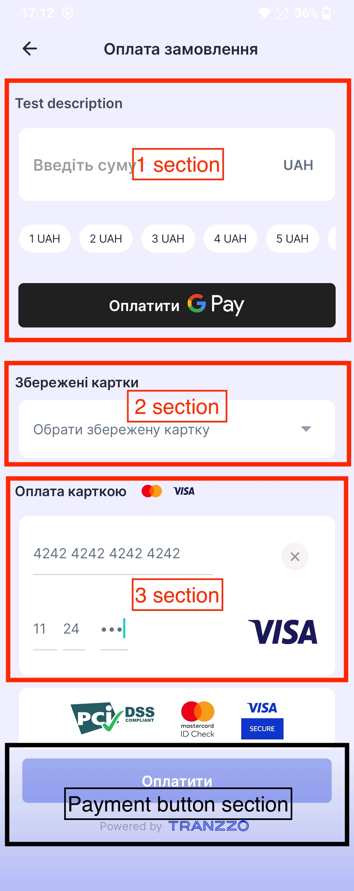
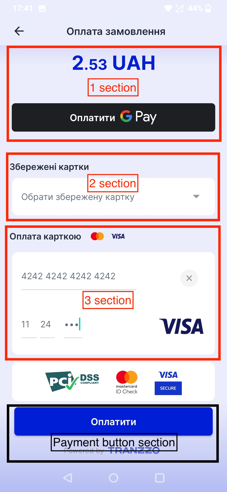
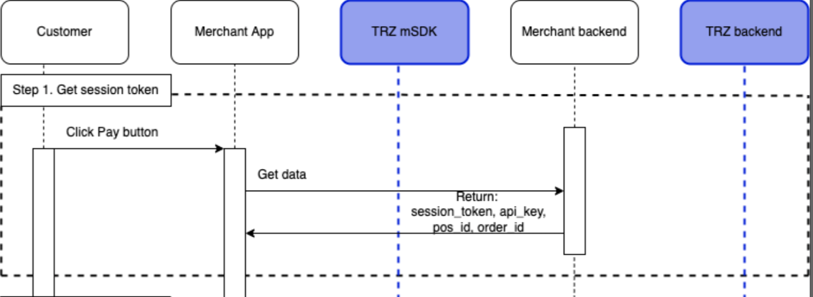
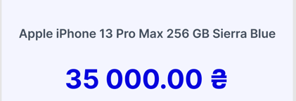
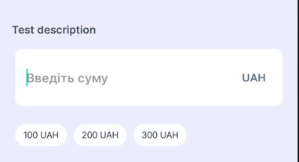
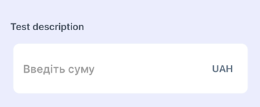
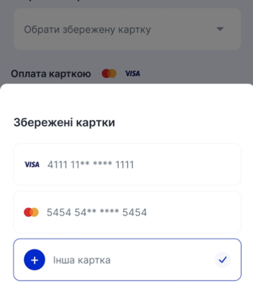
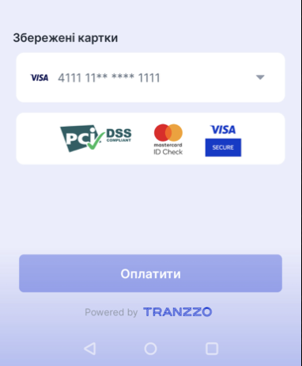

# UI overview

Payment screen consists of UI sections. Some of the sections can be replaced by merchant from already
constructed parts and some can't.

| Description             |                             |                                                               |
|  :------------------:   |:----------------------------------------------------------------------------------------------:|:------------------------------------------------------------------------------------------:|
| 1st section (amount section)    |      UI section which includes input field for entering amount and GPay button (optional)      | UI section which includes fixed amount and GPay button (optional). Amount can't be changed |
| 2nd section (tokenized cards section) |        The form for choosing the tokenized cards (optional)           |         The form for choosing the tokenized cards (optional) 
| 3d section (card data section) |                                The form for entering card data                    |             The form for entering card data   |
| Pay button  section   | Goes active in such cases: <ul><li> when user fills out all data in amount part (1st section) and choses the tokenized card (2nd sections) </li> <li> when user fills out all data in amount part (1st section) and in card form (3d section)  </li></ul>   |          Goes active when user chooses the tokenized card (2nd selection) or fills out all data in card form (3d selection)          

# Installation process:

#### 1) Add the dependency in the project:
Add following dependency in `build.gradle`:

```implementation 'com.tranzzo.android:payment_merchant:3.4.7'```.

Add following code to your `settings.gradle` file in `repositories` section:
```groovy
 repositories {
        maven {
            credentials {
              username "merchant_username"
              password "merchant_password"
            }
            url "https://nexus.tranzzo.com/repository/merchant-release-mvn/"
        }
    }
```

#### 2) Init the TranzzoPaymentSDK library in the Application class. For example:

```kotlin
TranzzoPaymentSDK.init(
    sdkEnvironment = SdkEnvironment.TEST / SdkEnvironment.PROD,
    googlePayConfig = GooglePayConfig(...), // null by default
    currency = "USD",
    countryCode = "USA",
    loggeerEnabled = true,
)
```
`googlePayConfig` is `null` by default. This config gives user the possibility to pay with
GooglePay. In case this config is `null` user will not see any GooglePay button on UI.

```kotlin
GooglePayConfig(
        merchantName = "your_merchant_name",
        merchantId = "your_merchant_id",
        environment = SdkEnvironment.TEST / SdkEnvironment.PROD
    )
```
`merchantName` is displayed in the payment list. 

`merchantId` is Google merchant identifier. Get it during the registration process in the Google
Pay Business Console. You can find more information about `merchantName` and `merchantId` [here](https://developers.google.com/pay/api/web/reference/request-objects#MerchantInfo).

Pass the `SdkEnvironment.TEST` to the `sdkEnvironment` and to `GooglePayConfig.environment` if you
want to test your payments with **test payment terminals**, otherwise pass the `SdkEnvironment.PROD`.
For `TEST` in `GooglePayConfig.environment` set the `merchantId = "01234567890123456789"` and join
the test group via [link](https://groups.google.com/forum/?hl=ru#!forum/googlepay-test-mode-stub-data) 
with your application production account.
For more details about testing GooglePay visit this [link](https://developers.google.com/pay/api/android/guides/resources/test-card-suite).

#### 3) Register for result in your `Activity` or `Fragment` in `onCreate()` method.

Example:

```kotlin
private lateinit var paymentLauncher: ActivityResultLauncher<PaymentContractInput>

override fun onCreate() {
    paymentLauncher =
        registerForActivityResult(PaymentContract()) { output: PaymentContractOutput ->
            Log.i("TAG", "Got payment result: $output")
        }
}
```

`PaymentContractInput` class that you will fill up with data for payment creation and processing. Object creation is described below from point 4) to point 5) in the list.

`PaymentContractOutput` class that will provide you with an information about payment result.
`PaymentContractOutput` will be one of following possible instances: `Success` or `Error`, or `Cancel`.

`Cancel` occurs when user presses *back button* on payment screen.

`Error` is a `sealed class` for error's representation. Below you can find a table of errors and their description:
<details>
<summary>Errors table</summary>
 
| Error name | Description |
| :----: | :----: |
| NoNetworkError | Error that occurs during payment, means that user doesn't have internet connection |
| PaymentFailure | Error may happen while proceed payment |
| NotFound3ds | Error may happen when payment requires 3ds url but not provide it. This error is rarely occurring but should be handled | 
</details>

#### 4) Prepare payment data for sending:
For sending data to the library you need to initialize the library provided data holder object `PaymentContractInput`. The structure of `PaymentContractInput`: 
```kotlin
// library code
data class PaymentContractInput(
    val keyConfig: KeyConfig,
    val customerData: CustomerData,
    val amountType: AmountType,
    val additionalData: AdditionalData = AdditionalData(),
    val cardModel: CardModel = CardModel(),
)
```
Follow me for `PaymentContractInput` creation:

a) Create `KeyConfig` object:

```kotlin
val keyConfig = KeyConfig(
    sessionToken = "your_session_token",
    apiKey = "your_api_key",
    posId = "your_pos_id",
)
```
**Merchant (your) backend should provide this data to your app.** 

In general the scheme of obtaining `KeyConfig` data looks like: 




b) Create `CustomerData` object that contains all your necessary data:

```kotlin
val customerData = CustomerData(
    customerEmail = "customer_email@example.com",
    customerPhone = "+111111111111",
    customerId = "customer_id", // optional, can be null
    customerFirstName = "example_first_name", // optional, can be null
    customerLastName = "example_last_name", // optional, can be null
    customerLanguage = "customer_language",  // optional, can be null
    customerCountry = "customer_country",  // optional, can be null
)
```

> *customerLanguage* supported values:
"EN", "RU", "ES", "PL", "AR", "AZ", "BG", "CS", "DA", "DE", "EL", "FA", "FI", "FR", "HE", "HI", "HR", "HU", "IT", "JA", "KO", "NL", "NO", "PT", "PT_BR", "RO", "SK", "SL", "SR", "Ї", "SV", "TH", "TR", "UK", "ZH", "ZH_HA"

c) Create `AmountType` object that contains all necessary information about payment amount type.

- In case user should have the fixed amount for payment you need to create the next object:
    ```kotlin
   val amountType = AmountType.ConstantAmount(
        amount = 1.11, // Double
        description = "your_product_description",
        orderId = "your_order_id",
        tokens = listOf<CardToken>(), // optional, emptyList() by default
   )
    ```
  `description` is the text will be displayed to user on the payment screen. Please, provide a
  readable product description.
  `tokens` is the list of `CardToken` objects. Empty by default. Creation of this object and its impact on merchant screen is described in the end of this list point.

  The UI example with fixed amount and product description:

  


- In case user can change the amount of payment by himself you need to create the next object:
    ```kotlin
    val amountType = AmountType.FreeAmount(
            prefillAmount = listOf(100, 200, 300), // list of already predefined amount values.
                                                   // Can be empty
            description = "your_product_description",
            orderId = "your_order_id",
            tokens = listOf<CardToken>(), // optional, emptyList() by default
        )
    ```
  `prefillAmount` is a list of already predefined amount values. Can be empty, but isn't empty by
  default.

  `description` is the text will be displayed to user on the payment screen. Please, provide a
  readable product description.
  `tokens` is the list of `CardToken` objects. Empty by default. Creation of this object and its impact on merchant screen is described in the end of this list point.

  The UI example with customizable amount, `prefillAmount` and product `description`:

  

  The UI example with customizable amount, `description` and empty `prefillAmount`.

  

  `CardToken` is a class that contains all required information for processing payments with tokenized cards, class has the following structure:
```kotlin
data class CardToken(
    val ccMask: String,
    val ccToken: String,
    val isDefault: Boolean,
)
```
Passing the `list<CardToken>` in the `AmountType` will impact the user screen by adding the 2d section (section for tokenized cards).


When user clicks on this section library opens bottom sheet dialog with the list of all provided `CardToken`s.



Selecting some card will close the bottom sheet, update the 2d section (section for tokenized cards) and remove the 3d section(manual card input section).



d) Create `AdditionalData` object that contains all additional information. 

```kotlin
// not required
val additionalData = AdditionalData(
    // required, default = PaymentMethod.PURCHASE 
    method = PaymentMethod.PURCHASE, // PaymentMethod.PURCHASE or PaymentMethod.AUTH
    // not required, default = null
    serverUrl = "", // String
    // not required, default = null
    products = emptyList(), // List<Product>
    // not required, default = null
    merchantMcc = "", // String
    // not required, default = null
    payload = "", // String
)
```
>`method` - payment method according with your business.\
>`payment3DsByPassType` - use of the 3DS protocol(default - **Supported**).\
>`serverUrl` - callback url on your server \
>`products` - array of products that are being paid for. \
>`merchantMcc` - MCC for this transaction. \
>`payload` - custom string data. Max 4000 symbols.

e) OPTIONAL: pass the predefined fields for 3d section (manual card data input section):
```kotlin
// not required
val cardModel = CardModel(
  cardInput = InputCardModel(
    number = "4242424242424242",
    expirationMonth = "11",
    expirationYear = "24",
    cvv = "123"
  ),
  supportedPaymentSystems = listOf<PaymentSystemType>(...) // default = listOf(PaymentSystemType.VISA, PaymentSystemType.MASTERCARD)
)
```

#### 5) Make a request for payment processing

```kotlin
paymentLauncher.launch(
    PaymentContractInput(
        keyConfig = keyConfig,
        customerData = customerData,
        amountType = amountType,
        additionalData = additionalData,
        cardModel = cardModel,
    )
)
```
That's it. Wait for response(PaymentModel) in point #3 of this list.

### PaymentStatus
```kotlin
enum class PaymentStatus {
  SUCCESS,
  FAILURE,
  PENDING;
}
```

#### SUCCESS

This status indicates that the transaction has been processed successfully.

#### FAILURE

This status indicates that the transaction has been rejected. The reasons for this may include 
specific errors at any stage of the payment process, such as incorrect payment data, activation 
of limits and checks, insufficient funds, and so on.

#### PENDING

This status is applicable to all types of transactions and indicates that the transaction is being 
processed by the bank or payment system. The SDK checks this status on its own and re-requests the 
status until it receives SUCCESS or FAILURE. But if the status does not change within 60 seconds, 
the client receives the PENDING status.

# UI customization

### Colors
SDK has many colors, but almost all app appearance is based on main color - `tranzzo_primary_color`.
This color builds SDK appearance by applying alpha color component. 
For example, the *Pay button* has a `tranzzo_primary_color` color, but in enabled state its alpha is 100% 
and in disabled state is only about 30%. Background color is based on main color with 8% alpha.
To change the UI colors override the color resources in xml.  
The colors table: 
```xml
    <color name="tranzzo_primary_color">#001ED4</color>
    <!-- background -->
    <color name="tranzzo_bg_100">#FFFFFF</color>
    <color name="tranzzo_bg_300">#F0F3FA</color>
    <color name="tranzzo_bg_500">#CED4E1</color>
    <color name="tranzzo_bg_700">#919AAB</color>
    <!-- fonts -->
    <color name="tranzzo_text_100">#919AAB</color>
    <color name="tranzzo_text_200">#637181</color>
    <color name="tranzzo_text_300">#454E5B</color>
    <color name="tranzzo_text_400">#212A36</color>
    <!-- errors -->
    <color name="tranzzo_error_color">#FFA6A6</color>
```

### Texts
Override text resources to change the text values. 
```xml
    <string name="tranzzo_ok">ОК</string>
    <string name="tranzzo_cancel">Скасувати</string>
    <string name="tranzzo_payment_3ds_title" translatable="false">Підтвердіть оплату</string>
    <string name="tranzzo_payment_press_back_again" translatable="false">Для виходу з оплати натисніть Назад ще раз</string>
    <string name="tranzzo_wrong_card_data">Невірні дані картки</string>
    <string name="tranzzo_input_manually">Введіть текст вручну</string>
    <string name="tranzzo_wait_for_card_nfc">Прикладіть картку до задньої сторони смартфона</string>
    <string name="tranzzo_card_scan_nfc_error">Помилка сканування.\nСпробуйте повтороно або введіть реквізити вручну.</string>
    <string name="tranzzo_to_settings">Перейти до налашутвань?</string>
    <string name="tranzzo_camera_permission">Налаштування дозволів камери</string>
    <string name="tranzzo_nfc_settings">Налаштування NFC</string>
    <string name="tranzzo_go_to_nfc_settings">NFC вимкнено, перейти в налаштування?</string>
    <string name="tranzzo_order_payment">Оплата замовлення</string>
    <string name="tranzzo_no_internet_connection">Інтернет зʼєднання відсутнє</string>
    <string name="tranzzo_message_google_pay_not_configured">GooglePay не налаштовано</string>
    <string name="tranzzo_message_google_pay_service_not_available">Сервіс GooglePay недоступний</string>
    <string name="tranzzo_message_google_pay_payment_error">Помилка при спробі оплати за допомогою GooglePay</string>
    <string name="tranzzo_pay_button_text">Оплатити</string>
    <string name="tranzzo_pay_gpay_title">Оплатити</string>
    <string name="tranzzo_nfc_ready_for_scanning">Готово до сканування</string>
    <string name="tranzzo_nfc_cancel">Скасувати</string>
    <string name="tranzzo_pay_with_card">Оплата карткою</string>
    <string name="tranzzo_hint_enter_amount">Введіть суму</string>
    <string name="tranzzo_enter_or_scan_card">Введите или отсканируйте</string>
    <string name="tranzzo_month">ММ</string>
    <string name="tranzzo_year">РР</string>
    <string name="tranzzo_cvv">CVV</string>
    <string name="tranzzo_payment_processing">Обробка платежу</string>
    <string name="tranzzo_saved_cards">Збережені картки</string>
    <string name="tranzzo_non_tokenized_card">Інша картка</string>
    <string name="tranzzo_choose_tokenized_card">Обрати збережену картку</string>
```

