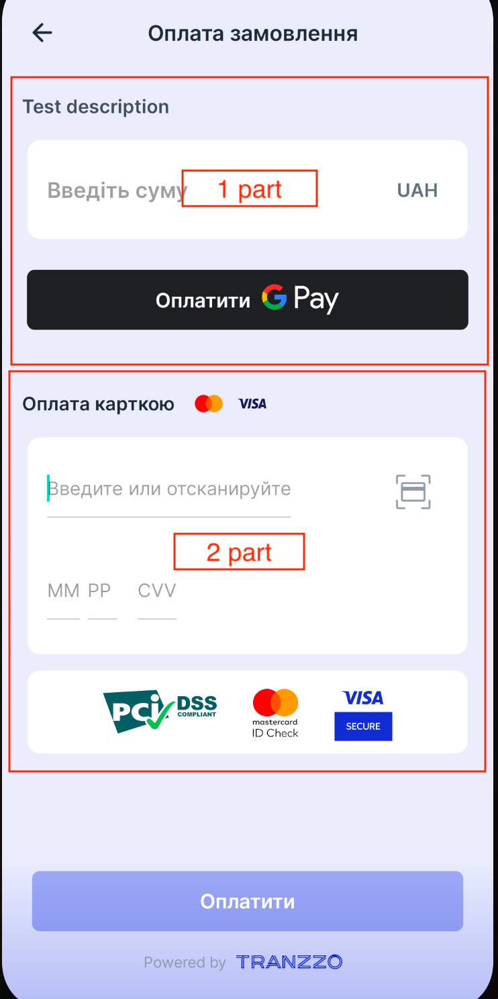
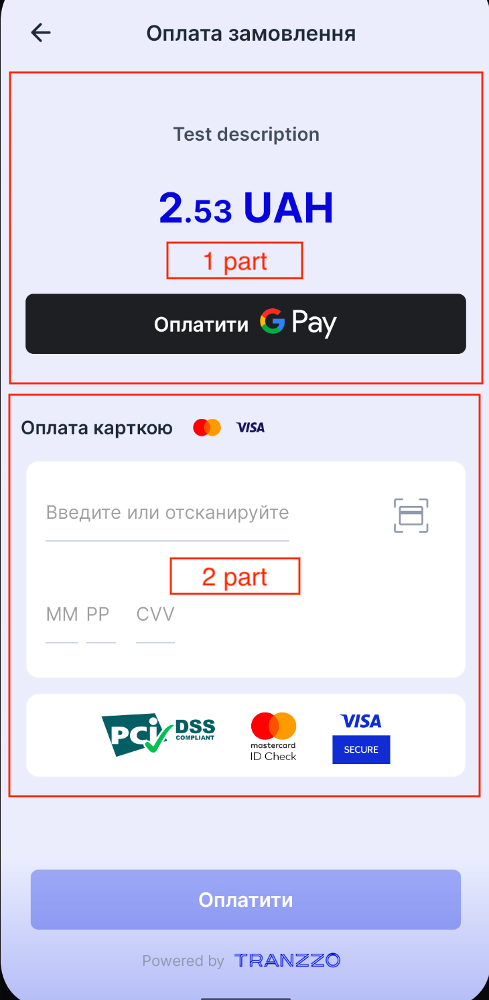
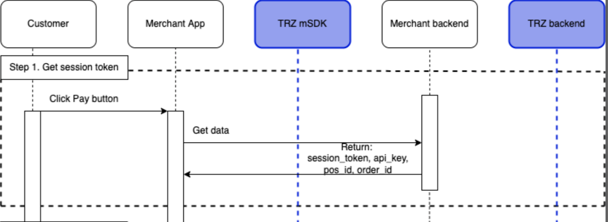
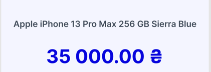
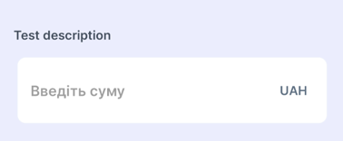

# UI overview

Payment screen consists of UI sections. Some of the sections can be replaced by merchant from already
constructed parts and some can't.

| Description             |   |  |
|  :------------------:   |  :-------------------:   |  :------------------:   |
| 1st part (amount section)    | UI section which includes input field for entering amount and GPay button (optional) | UI section which includes fixed amount and GPay button (optional). Amount can't be changed |
| 2nd part (card data section) | The form for entering card data  |  The form for entering card data |
| Pay button                 | Goes active when user fills out all data in amount part (1st part) and card section (2nd part)  | Goes active when user fill out all card data in card section (2nd part)

# Installation process:

#### 1) Add the dependency in the project:
Add following dependency in `build.gradle`:

```implementation 'com.tranzzo.android:payment_merchant:3.0.0-rc10'```.

Add following code to your `settings.gradle` file in `repositories` section:
```groovy
 repositories {
        maven {
            credentials {
              username "merchant_username"
              password "merchant_password"
            }
            url "https://nexus.tranzzo.com/repository/merchant-release-mvn/"
        }
    }
```

#### 2) Init the TranzzoPaymentSDK library in the Application class. For example:

```kotlin
TranzzoPaymentSDK.init(
    sdkEnvironment = SdkEnvironment.TEST / SdkEnvironment.PROD,
    googlePayConfig = GooglePayConfig(
        merchantName = "your_merchant_name",
        merchantId = "your_merchant_id",
        environment = SdkEnvironment.TEST / SdkEnvironment.PROD
    ), // null by default
    currency = "USD",
    countryCode = "USA"
)
```

Pass the `SdkEnvironment.TEST` to the `sdkEnvironment` and to `GooglePayConfig.environment` if you
want to test your payments with **test payment terminals**, otherwise pass the `SdkEnvironment.PROD`
.

`googlePayConfig` is `null` by default. This config gives user the possibility to pay with
GooglePay. In case this config is `null` user will not see any GooglePay button on UI.

#### 3) Register for result in your `Activity` or `Fragment` in `onCreate()` method.

Example:

```kotlin
private lateinit var paymentLauncher: ActivityResultLauncher<PaymentContractInput>

override fun onCreate() {
    paymentLauncher =
        registerForActivityResult(PaymentContract()) { output: PaymentContractOutput ->
            Log.i("TAG", "Got payment result: $output")
        }
}
```

`PaymentContractInput` class that you will create for payment creation and processing.

`PaymentContractOutput` class that will provide you with an information about payment result.
`PaymentContractOutput` will be one of following possible instances: `Success` or `Error`, or `Cancel`.

`Cancel` occurs when user presses *back button* on payment screen.

`Error` is a `sealed class` for error's representation. Below you can find a table of errors and their description:

| Error name | Description |
| :----: | :----: |
| NoNetworkError | Error that occurs during payment, means that user haven't internet connection |
| PaymentFailure | Error may happen while proceed payment |
| ProcessingFailure | Errors may happen while processing return one of the next payment statuses: `Failure`, `Rejected` or when processing return `Pending` or `Waiting` for a long period of time. |
| NotFound3ds | Error may happen when payment requires 3ds url but not provide it. This error is rarely occurring but should be handled | 


#### 4) Prepare payment data for sending:

a) Create `KeyConfig` object:

```kotlin
val keyConfig = KeyConfig(
    sessionToken = "your_session_token",
    apiKey = "your_api_key",
    posId = "your_pos_id",
)
```
**Merchant (your) backend should provide this data to your app.** 

In general the scheme of obtaining `KeyConfig` data looks like: 




b) Create `CustomerData` object that contains all your necessary data:

```kotlin
val customerData = CustomerData(
    customerEmail = "customer_email@example.com",
    customerPhone = "+111111111111",
    customerId = "customer_id", // optional, can be null
    customerFirstName = "example_first_name", // optional, can be null
    customerLastName = "example_last_name", // optional, can be null
    customerLanguage = "customer_language",  // optional, can be null
    customerCountry = "customer_country",  // optional, can be null
)
```

> *customerLanguage* supported values:
"EN", "RU", "ES", "PL", "AR", "AZ", "BG", "CS", "DA", "DE", "EL", "FA", "FI", "FR", "HE", "HI", "HR", "HU", "IT", "JA", "KO", "NL", "NO", "PT", "PT_BR", "RO", "SK", "SL", "SR", "Ї", "SV", "TH", "TR", "UK", "ZH", "ZH_HA"

c) Create `AmountType` object that contains all necessary information about payment amount type.

- In case user should have the fixed amount for payment you need to create the next object:
    ```kotlin
   val amountType = AmountType.ConstantAmount(
        amount = 1.11, // Double
        description = "your_product_description",
        orderId = "your_order_id",
   )
    ```
  `description` is the text will be displayed to user on the payment screen. Please, provide a
  readable product description.

  The UI example with fixed amount and product description:

  


- In case user can change the amount of payment by himself you need to create the next object:
    ```kotlin
    val amountType = AmountType.FreeAmount(
            prefillAmount = listOf(100, 200, 300), // list of already predefined amount values.
                                                   // Can be empty
            description = "your_product_description",
            orderId = "your_order_id",
        )
    ```
  `prefillAmount` is a list of already predefined amount values. Can be empty, but isn't empty by
  default.

  `description` is the text will be displayed to user on the payment screen. Please, provide a
  readable product description.

  The UI example with customizable amount, `prefillAmount` and product description:

  

  The UI example with customizable amount, description and empty `prefillAmount`.

  

#### 5) Make a request for payment processing

```kotlin
paymentLauncher.launch(
    PaymentContractInput(
        keyConfig,
        customerData,
        amountType,
    )
)
```
That's it. Wait for response in point #3 of this list.

# UI customization

### Colors
SDK has many colors, but almost all app appearance is based on main color - `tranzzo_primary_color`.
This color builds SDK appearance by applying alpha color component. 
For example, the *Pay button* has a `tranzzo_primary_color` color, but in enabled state its alpha is 100% 
and in disabled state is only about 30%. Background color is based on main color with 8% alpha.
To change the UI colors override the color resources in xml.  
The colors table: 
```xml
    <color name="tranzzo_primary_color">#001ED4</color>
    <!-- background -->
    <color name="tranzzo_bg_100">#FFFFFF</color>
    <color name="tranzzo_bg_300">#F0F3FA</color>
    <color name="tranzzo_bg_500">#CED4E1</color>
    <color name="tranzzo_bg_700">#919AAB</color>
    <!-- fonts -->
    <color name="tranzzo_text_100">#919AAB</color>
    <color name="tranzzo_text_200">#637181</color>
    <color name="tranzzo_text_300">#454E5B</color>
    <color name="tranzzo_text_400">#212A36</color>
    <!-- errors -->
    <color name="tranzzo_error_color">#FFA6A6</color>
```

### Texts
Override text resources to change the text values. 
```xml
    <string name="tranzzo_ok">ОК</string>
    <string name="tranzzo_cancel">Скасувати</string>
    <string name="tranzzo_payment_3ds_title" translatable="false">Підтвердіть оплату</string>
    <string name="tranzzo_payment_press_back_again" translatable="false">Для виходу з оплати натисніть Назад ще раз</string>
    <string name="tranzzo_wrong_card_data">Невірні дані картки</string>
    <string name="tranzzo_input_manually">Введіть текст вручну</string>
    <string name="tranzzo_wait_for_card_nfc">Прикладіть картку до задньої сторони смартфона</string>
    <string name="tranzzo_card_scan_nfc_error">Помилка сканування.\nСпробуйте повтороно або введіть реквізити вручну.</string>
    <string name="tranzzo_to_settings">Перейти до налашутвань?</string>
    <string name="tranzzo_camera_permission">Налаштування дозволів камери</string>
    <string name="tranzzo_nfc_settings">Налаштування NFC</string>
    <string name="tranzzo_go_to_nfc_settings">NFC вимкнено, перейти в налаштування?</string>
    <string name="tranzzo_order_payment">Оплата замовлення</string>
    <string name="tranzzo_no_internet_connection">Інтернет зʼєднання відсутнє</string>
    <string name="tranzzo_message_google_pay_not_configured">GooglePay не налаштовано</string>
    <string name="tranzzo_message_google_pay_service_not_available">Сервіс GooglePay недоступний</string>
    <string name="tranzzo_message_google_pay_payment_error">Помилка при спробі оплати за допомогою GooglePay</string>
    <string name="tranzzo_pay_button_text">Оплатити</string>
    <string name="tranzzo_pay_gpay_title">Оплатити</string>
    <string name="tranzzo_nfc_ready_for_scanning">Готово до сканування</string>
    <string name="tranzzo_nfc_cancel">Скасувати</string>
    <string name="tranzzo_pay_with_card">Оплата карткою</string>
    <string name="tranzzo_hint_enter_amount">Введіть суму</string>
    <string name="tranzzo_enter_or_scan_card">Введите или отсканируйте</string>
    <string name="tranzzo_month">ММ</string>
    <string name="tranzzo_year">РР</string>
    <string name="tranzzo_cvv">CVV</string>
    <string name="tranzzo_payment_processing">Обробка платежу</string>
```

